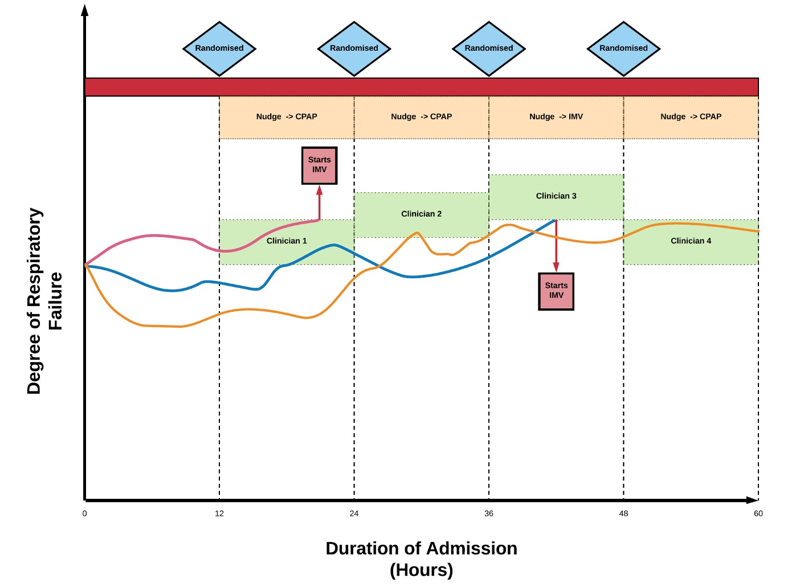

### COVID-19 and this proposal

This proposal was originally submitted in January 2020 with peri-operative medicine as its target domain.

I argued then that peri-operative medicine was an ideal space within which to develop this novel methodology, because I could start with a pre-emptive consent model implemented in the pre-assessment clinic, before moving to presumed (opt-out) consent. I built the previous version of this proposal around the evaluation of magnesium supplementation, and oxygen saturation targets in the peri-operative period. These interventions were selected because they were part of routine care wherein I could already identify variation in practice, where there was no gold standard randomised controlled trial evidence recommending a single approach, and where a there was a reasonable chance that a more personalised treatment approach provide benefit.

I am now resubmitting in October 2020 as we head into the winter with a second surge of SARS-CoV-2 very likely. I continue to believe that better methods for improving evidence generation should be our highest priority. This remains the focus of this application. I recognise that both classical RCTs, and modern interpretations of the RCT (RECOVERY, and REMAP-CAP) are addressing key treatment questions. However, as rehearsed in detail below, these implementations can never hope to provide answers to the full range of scenarios that bedside clinicians must tackle. RECOVERY runs with five treatment arms and recruited 10,000 patients over just a couple of months, and REMAP-CAP with four domains and around 1,500 over a slightly longer time period. These trials are focused evaluations of specific, sometimes novel, sometime repurposed drug treatments. Even together, they address less than ten interventions representing a small fraction of the decisions that constitute the care pathway.

For example, there are no trials evaluating the timing of intubation and ventilation for SARS-CoV-2. I do not know when to prone or stop proning patients. I have no evidence to select a particular PEEP target, nor what level of oxygen saturation is acceptable. The list of questions is almost innumerable. Should I humidify the ventilator circuits? What level of d-dimer would trigger investigation for pulmonary embolism? How much does fluid balance affect the risk of progression to respiratory failure and acute kidney injury? Crucially, even if I did find the resource to study each of these topics in an RCT, the final answer would be incomplete as it is inevitable that what is true on average will not be true for all patient subgroups. Some patients will tolerate lower oxygen saturations better than others. Some will need a more generous fluid balance and so on.

I argue now that the best response to COVID-19 is not a disease specific study, but a programme of work that would permit more rapid evidence generation. This is not a sop to the request from the grant panel for COVID-19 orientated research, but a sincere claim. In April, in the midst of the first surge, we tried hard to implement a version of PreMEDS+R to examine the safety of CPAP for COVID-19. Variation in practice was already rife without a strong evidence base for either the 'early intubation' or 'CPAP first' approach.[Harris BJA 2020] Personal communication with proponents of each approach revealed that equipoise existed for most, but that the point of equipoise varied substantially. Some would tolerate a very brief trial of CPAP, and others a very prolonged trial. Few would rule out either strategy in *all* circumstances. The question was not 'CPAP first' versus 'early intubation' but was there a subgroup who would benefit from a period of CPAP, and if so how long was it safe to continue CPAP (if it was tried). This could not be easily collapsed down into a standard parallel arm RCT.

We instead prepared a protocol (Appendix 1) using the methodology in this proposal that permitted each clinician to participate, treat as per their own judgement where they had confidence in their approach, and randomise within their own 'zone' of equipoise. 

However, even with the local support that we received (and had the first surge of COVID-19 continued for longer in London), there were too many novel steps to implement. This is why the timescale of this grant call is more appropriate for this work. Moreover, retaining the original focus on peri-operative medicine is important because this remains an area of unmet need that has not been diminished by this crisis, and because my existing group of collaborators gives this the best possible chance of success.

If SARS-CoV remains a major part of critical care going forwards, then we are now laying the foundations for delivering the answers to this and other questions that confront the bedside clinician, and will not be suitable for trials such as RECOVERY, REMAP-CAP or similar.
