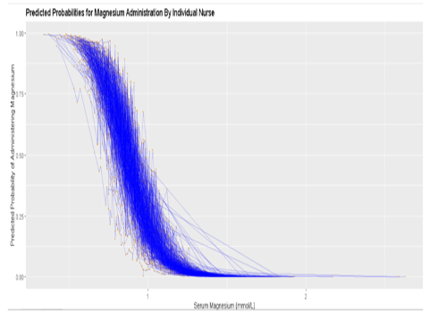

{>>Target 5000 words<<}

# Title

PreMEDS+R: Precision Medicine via Embedded Decision Support with Randomisation 
Developing a novel trials methodology for peri-operative medicine

# Aim and objective (aka hypothesis)

> When there is genuine equipoise between two commonly used treatments, _not_ doing a point of care trial to find out which has a better risk/benefit profile seems _unethical_. Pragmatic RCTs could enable clinically important questions that can be answered fast based on studies carried out in routine care settings on a full range of participants.

**Learning Health Care Systems in the NHS**. Nuffield Trust Seminar, January 2019[@scobie2020]

## Hypothesis
That there is a portion of clinical care that can be optimised in a methodologically rigorous and ethically sound manner without resorting to standard parallel arm randomised controlled clinical trials.

## Aim
This project aims to develop the framework for a learning health care system for peri-operative medicine using established infrastructure at a single site but with a pathway to scale to multiple sites. 

### Deliverables (Work packages)
1. A high-quality prospective peri-operative medicine database built to scale across multiple NHS sites
2. A pair of exemplar physician-prescribing preference studies
	a. Comparison of conservative versus liberal oxygen targets on post-operative morbidity following high risk surgery admitted to critical care
	b. Comparison of high versus low targets of Magnesium supplementation on post-operative atrial fibrillation following high risk surgery admitted to critical care	 
3. A programme of work leading to a pilot embedded randomised controlled trial using a novel _nudge_ design also built to scale across multiple NHS sites (**PreMEDS+R**)

I provide two worked examples (2a and 2b). However, this proposal is methodological, and other clinical questions would also be suitable, and may be prioritised by the integrated patient and public involvement (PPI) pathway.

### COVID-19 and this proposal

This proposal was originally submitted in January 2020 with peri-operative medicine as its target domain.

I argued then that peri-operative medicine was an ideal space within which to develop this novel methodology, because I could start with a pre-emptive consent model implemented in the pre-assessment clinic, before moving to presumed (opt-out) consent. I built the previous version of this proposal around the evaluation of magnesium supplementation, and oxygen saturation targets in the peri-operative period. These interventions were selected because they were part of routine care wherein I could already identify variation in practice, where there was no gold standard randomised controlled trial evidence recommending a single approach, and where a there was a reasonable chance that a more personalised treatment approach provide benefit.

I are now resubmitting in October 2020 as I head into the winter with a second surge of SARS-CoV-2 very likely. I continue to believe that the need to develop better methods for improving evidence generation should be the highest priority, and this remains the focus of our application. I recognise that both classical RCTs, and modern interpretations of the RCT (RECOVERY, and REMAP-CAP) are addressing key treatment questions. However, as rehearsed in detail below, these implementations can never hope to provide answers to the full range of scenarios that bedside clinicians must tackle. RECOVERY runs with five treatment arms and recruited 10,000 patients over just a couple of months, and REMAP-CAP with four domains and around 1,500 over a slightly longer time period. These trials are focused evaluations of specific, sometimes novel, sometime repurposed drug treatments. Even together, they address less than ten interventions representing a small fraction of the decisions that constitute the care pathway.

For example, there are no trials evaluating the timing of intubation and ventilation for SARS-CoV-2. I do not know when to prone or stop proning patients. I have no evidence to select a particular PEEP target, nor what level of oxygen saturation is acceptable. The list of questions is almost innumerable. Should I humidify the ventilator circuits? What level of d-dimer would trigger investigation for pulmonary embolism? How much does fluid balance affect the risk of progression to respiratory failure and acute kidney injury? Crucially, even if I did find the resource to study each of these topics in an RCT, the final answer would be incomplete as it is inevitable that what is true on average will not be true for all subgroups. Some patients will tolerate lower oxygen saturations better than others. Some will need a more generous fluid balance.

However, whilst this proposal provides a route to answering these questions, I have retained the focus on peri-operative medicine.  I did carefully consider reorientating the proposal toward treatment of SARS-CoV-2, but I do not think that would be right. I do not wish to create an expectation that I could provide answers that will be relevant to this surge, or even this pandemic. This would be unrealistic for a proposal that runs over four years with a pandemic that evolves week by week. In contrast, peri-operative medicine may be currently less topical but it represents a huge unmet need that has not been diminished by our current health crisis. I am also fortunate in that I have with my existing collaborators (Moonesinghe) the best possible chance of seeing this to success. 

This does not diminish the needs for better learning systems for SARS-CoV-2. With a new disease, there too is great opportunity for learning, and arguably even greater variation in practice.  I have kept our original two target questions in this proposal. The oxygen target saturation is relevant to both peri-operative work and to respiratory failure in general. Suitable targets for supplementation of magnesium has less cross-over but my group has also already developed relevant preparatory work for this. I note though that the nature of the implementing a learning health care system involves building an active and genuine collaboration with patients. This means that it is likely that the target questions will be modified as I proceed through the four years. If SARS-CoV remains a major part of our work, then we too will pivot as needed. I believe this is eminently possible given the existing resource and infrastructure of the Critical Care Health Informatics Collaborative.

---

# Background
**Learning health care systems** "... integrate the practice of medicine and the generation of reliable medical evidence in a way that will promote both continuous learning and evidence based medical practice.[@london2018] The programme of work proposed here integrates digital health and _nudged_ rather than _mandated_ randomised interventions to create a safe, ethical delivery framework for this oft-cited and yet rarely implemented goal. I specifically focus on optimising the delivery of routine health care where pre-existing variation in practice implies clinical equipoise. The end result would be a system that delivers causally robust personalised treatment effects at scale.

I build on the following three concepts: digital health, nudged interventions, and variation in practice:

1. **Digital health**

>  Digital health can potentially offer the solutions needed to transform clinical trials ... However, this cannot be accomplished by replicating the current research processes and just transforming them from paper to digital form ... Rather, a complete re-thinking and re-engineering of the clinical trial experience around the participant rather than the research site is needed.[@steinhubl2019]

2. **Nudged interventions**

> A nudge ... is any aspect of the choice architecture that alters people’s behavior in a predictable way without forbidding any options ... Nudges are not mandates.[@thaler2009@6]

3. **Variation in practice implies clinical equipoise and treatment heterogeneity** 	

- > equipoise[^a]: ... honest, professional disagreement among expert clinicians about the relative clinical merits of interventions A and B for a particular patient population[@london2018] 

- > treatment homogeneity versus heterogeneity[@longford1999]:
> - homogeneity: treatment B is superior to treatment A for (almost) everybody in the designated population; 
> - heterogeneity: treatment B is superior to treatment A for an average or typical subject in the designated population. *B may be inferior for a non-trivial proportion of subjects*.

Most importantly, it is crucial that this proposal is not read as a criticism of randomised controlled trials (RCT) in general. Rather this is an adaption of the RCT methodology to meet the need to deliver evidence based personalised medicine recommendations. As such, this approach is inappropriate for the investigation of novel drugs and interventions (e.g. CTIMPS, ATIMPS and other scenarios).

4. **Optimum targets rather than binary comparisons** 
- [ ] TODO insert this as your 4th area of focus

## Narrative

**Hundreds of millions of decisions** are made every day by doctors, nurses and allied health professionals. Most decisions are so small and routine that we don't always notice them: do we give paracetamol for a fever? do we target an oxygen saturation of 94% or 98%; do we stop the antibiotics this morning or this afternoon? But it is inconveivable that the aggregate effect of all these decisions is unimportant.
Randomised controlled trials (RCTs) are our 'go to' method for studying a single decision. But **traditional RCTs are slow, expensive and cumbersome**. Moreover they deliver results that are true on _average_ but not adapted for the individual. Personalised medicine recognises that variations in genotype and phenotype require treatments to be appropriately adapted. With unlimited sample size, such evidence could be generated but the cost would be prohibitive. Machine learning (ML) offers to use 'big data' to derive endotypes[^b] but without randomisation observational research remains vulnerable to bias through unmeasured confounding. This is also true for Artificial Intelligence (AI) techniques such as reinforcement learning.[@palmer2019; @komorowski2018]
Parallel two arm (A vs B) RCTs are now being replaced with intelligent designs such as REMAP (**Randomised Embedded Multifactorial Adaptive Platform**) trials.[@angus2015] This automates data collection by **E**mbedding the trial in electronic health record (EHR). It **A**dapts the randomisation algorithm so that as a signal for benefit or harm emerges patients are preferentially allocated to the best strategy. And finally, **M**ultiple treatments (factors) are evaluated together using the same **P**latform so the cost of setting the trial up is shared. REMAP-CAP is the first attempt at this approach evaluating antibiotics, anti-virals and steroids for Community Acquired Pneumonia (CAP).[@2016a] Nonetheless, this is still a hugely expensive international collaboration recruiting initally 2800 patients across 50 sites over several years.[@2016b]
The final result from REMAP-CAP will true _on average_ but cannot provide the right answer for the each patient who may have an allergy to the 'best' antibiotic, or be more susceptible to the immune suppression induced by the steroids, and so on. This **treatment heterogeneity** is driven by subtle endotypes not exposed by the RCT.[@iwashyna2015a] And herein lies the skill of the clinician. To take that average answer and decide if it applies to the particular situation. But while there is shared expertise, each clinician's personal experience creates variation. 
We normally see such variation as a problem.[@wennberg2011] Electronic Health Record Systems (EHRS) often provide clinical decision support tools to improve compliance with evidence and reduce variation. It is assumed that the busy clinician who is more often unwittingly deviating from a guideline rather than personalising treatment. 
But what if we used decision support to both **reduce variation where strong evidence is available, _and_ to learn from the existing variation where evidence is sparse**.
We call this approach _**nudge learning**_, and propose a trial design called _**PreMEDS+R**_. This design will ultimately depend on _presumed_ (opt-out) consent to allow the trial to scale, and through scale investigate treatment heterogeneity. However, such a paradigm shift in clinical trial implementation requires a pragmatic and stepped approach. This project proposes a stepped implementation building first (1) a high quality database to confirm treatment variation and capture the rich data needed for an embedded RCT; then (2) a programme of work that carefully evaluates patient and clinician acceptance of a nudge methodology; and (3) implements a pilot PreMEDS+R trial in high risk surgery to estimate nudge compliance, and likely treatment effect sizes. The design is such that if successful the pilot study will then transform to a multi-site learning health care  programme to optimise care of the high risk surgical patient. 
We argue that this is the perfect domain in which to develop this methodology because **we leverage the anaesthetic pre-assessment clinic** to run the initial work using a _pre-emptive_ rather than presumed consent model.

# Project plan

This 4 year programme will build on three existing programmes. 

1. The established **Critical Care Health Informatics Collaborative** (CCHIC) programme that holds data on 45000+ adminssions from 10+ NHS ICUs.[@harris2018b] The existing governance and data flows create an opportunity to magnify the influence of the RCOA/BOC grant to scale across multiple sites. 
2. The **Experimental Medicine Application Platform** (EMAP) at UCLH where we have a proven track record of deploying novel applications in realtime against the hospital wide EHRS. More specifically, my team has spent the last two years building EMAP exactly to enable this sort of work.  EHR systems alone do not permit innovation and development. They are hampered by vendor lock-in, and by the need to prioritise clinical safety and reliability above all else. EMAP is a data science platform built for the NHS inside the NHS according to the following principles (1) Protection of operational systems by deploying a live mirror of the EHRS (2) Protection of patient privacy by following a 'code-to-data' rather than 'data-to-code' paradigm (3) Health care interoperability to permit cross-site collaboration and (4) Open source to foster a community of practice.
3. An existing collaboration with the Centre for Peri-operative Medicine at (CPOM) that has nurtured the last two Sprint National Anaesthesia Projects (SNAP). Together with Professor Moonesinghe, I co-led SNAP-2 that build a managed a (inter)national data set for high risk inpatient surgery.

## Work package 1: CCHIC-Peri-op
**Objective: Build an extension to the Critical Care Health Informatics Collaborative (CCHIC)**

The NIHR established the Health Informatics Collaborative in 2014. UCL/UCLH has led the Critical Care theme.[@harris2018b] I have co-led the project (with Singer/Brealey/MacCallum) since 2015. We have ethics (REC 14/LO/103) and CAG approval (14/CAG/1001) plus data sharing agreements for 7 UK sites (including Cambridge/GSTT-Kings/Imperial/Oxford/UCL and now the Royal Marsden and Bristol). Routinely collected clinical data from critical care admissions is transferred to UCL's  ISO/IEC 27001:2013 compliant [data safe haven](https://www.ucl.ac.uk/isd/services/file-storage-sharing/data-safe-haven-dsh) where it is organised, cleaned, linked to Hospital Episode Statistics ([HES](https://digital.nhs.uk/data-and-information/data-tools-and-services/data-services/hospital-episode-statistics)) to define health care utilisation and long term survival, and then made available as resource back to the critical care community.
Since 2015, **we have curated data for >45,000 admissions to critical care with 250 data items and >250 million data points**. This resource has led to a series of publications[@palmer2019a; @meiring2018], and high profile presentations (Hot Topics, Intensive Care Society 2019). We have also launched an educational programme including datathons and training courses for clincal data scientists.[@harris] We have had a favourable review of our ethics (2019 5 year review), and ongoing support at PPI events.

- we will extend the scope of the ethics and the collaboration agreements with participating sites to the same cohort studied under the recent 2^nd^ Sprint National Anaesthesia Project (SNAP-2 EpiCCS: Epidemiology of Critical Care after Surgery).[@moonesinghe2017] That is **patients staying in hospital overnight undergoing a surgical or interventional procedure that requires the prescence of an anaesthetist**.
- we will expand the data specification to include **key case mix measures for peri-operative medicine** (patient comorbidites, risk factors, surgical procedures, anaesthetic techniques and intra- and post-operative complications) leveraging experience with SNAP-2, PQIP[@wagstaff2019] and NELA[@eugene2018]
- we will standardise and generate **five high quality outcome measures** from these data (1) mortality (2) length of stay (3) planned and unplanned critical care admission and (4) POMS[@grocott2007] and (5) using the existing CCHIC permissions (HES/ONS) to define health care utilisation and long term survival
- we will add metadata to all drugs, orders, and treatment decisions to capture a pseudonymised identifier for the clinical decision maker to build evidence for variation in practice, and preparatory physician-prescribing preference studies[@rassen2009c]
- the scale and scope of data collection requires hospitals that have integrated Electronic Health Records (EHRs). The interventional arm of the study further requires a working clinical decision support technology. We have already had a favourable response from approaching the Cambridge BRC (see attached letter of support from Dr Ari Ercole). 

We would see this CCHIC:Peri-op becoming the _premier international resource for observational studies of high risk surgery and peri-operative medicine_. Just at UCLH trust (including RNTNE, NHNN, WMS) we would expect to recruit >10,000 patients per year. Using the NIHR Health Informatics Collaborative network as a springboard alongside extensive and broad networks developed running SNAP-2/EpiCCS, we would seek funding to expand to further sites during the 4 years.

- [ ] TODO see existing notes in word document that are not replicated here

## Work package 2: Patient and Public involvement
**Objective: Build a patient, public, clinical and academic community to guide the development of this methodology**

My team has already started a series of patient-public involvement panels for this work. Initial meetings have been positive but highlighted the difficulty in explaining the (1) natural variation that occurs with clinical care and (2) why we are not already performing research of this kind. Feedback has suggested that opt-out consent is likely to be acceptable to many, but depends on appropriate communication. We have a small grant from UCLH BRC that we will use to supplement the funds allocated from this proposal to build a dedicated patient and public panel to work with us for the duration of the project. UCLH BRC has expressed interest in this work, and already supports the AboutMe initiative[^c] that also embeds research into the clinical care pathways (focusing initially on stroke and the genomics of hypertension).

Patient and public involvement will be needed to
- define and prioritise questions that might be suitable for the PreMEDS+R design
- design and understand the communication issues necessary to be confident that we have adequate explanations of the risks and benefits of this approach for a wide range of health service users
- design the qualitative interviews that will be conducted in the pilot phase (WP5) that will guide the transition from pre-emptive to opt-out consent
- design the monitoring process that will be used to ensure that PreMEDS+R recruits, the right safeguards are in place to deliver the best evidence from existing literature and from the evolving inputs generated from the trial

We will appoint patient representatives to the project steering committee from the outset. We will deliver a series of focus group meetings that will help use build the communication strategy outlined above, and where necessary create appropriate media (patient information leaflets, posters, videos etc.) that can be used going forwards. We will then report back the qualitative feedback from the pilot trial to this group, and seek their guidance in understanding whether or not we have reached a stage where opt-out consent is a reasonable approach for the question at hand.

## Work package 3: A toolkit for Clinician Prescribing Preference studies
**Objective: Build a pipeline for rapid observational evaluation of interventions using variation in practice**

Clinician Prescribing Preference (CPP) studies exploit natural variation in practice. A classic example comes from the psychiatric literature where GPs have been show to have consistent preferences for different classes of Selective Serotonin Uptake Inhibitors (SSRIs) and Tricyclic Antidepressants (TCAs).[@davies2013] Patients treatments therefore depended on which GP they attended. Given that GP assignment can be argued to be unrelated to the self-harm/suicide (after controlling for social deprivation etc.) then this permits an evaluation of the relative effectiveness of these drugs.

My group has already completed an initial evaluation of this approach studying magnesium supplementation. We examined adult admissions to University College London Hospital Critical Care Unit (2016-17). Each patient’s admission was divided into ‘treatment windows’: including a serum magnesium measurement, an opportunity for supplementation linked to the bedside nurse on duty, and a period of observation (roughly equivalent to the 'day shift') for Atrial Fibrillation (AF). We identified 9,114 magnesium prescribing opportunities (1,914 patients). Approximately one-third of the variation in magnesium supplementation was due to the bedside nurse (see figure below) such that magnesium was supplemented on 48% of occasions where the nurse's habits placed them in the 'liberal' supplementation group versus 28% of occasions with 'conservative' nurses. AF was uncommon overall but decreased by approximately 3% when patient's were cared for by 'liberal' magnesium supplementers.

We will use the pseudonymised reference to the prescriber captured in CCHIC-periop (WP1) to define clinician's prescribing preferences for magnesium and oxygen saturation targets. Because prescribing preference is only one of many factors that affects the treatment decision then there is imperfect compliance. In other words, we are imagining an RCT where the patient's exposure to a pro- or anti- Magnesium 'top-up' clinician is the random coin toss. Other factors may trump the prescriber's preference (i.e. recent arrhythmias) but where the prescriber is otherwise indifferent then their inherent preference will affect the decision. For these marginal cases, we can use an Instrumental Variable (IV) technique to evaluate the causal effect of Magnesium on subsequent arrhythmias.

This method both demonstrates the degree of exising variation in practice, and gives us an initial look at the likely effect size. We would repeat these studies as part of the evaluation pathway for any intervention being considered for PreMEDS+R. This work package builds a robust, reproducible, and repeatable pipeline for generating this evidence. And this evidence then informs the priorities, and design of the prospective evaluations in WP3 and WP5. As CCHIC-Periop expands, the incremental cost of studying additional interventions will decrease. Other suitable targets might include transfusion triggers, oxygen targets, blood pressure targets, and antibiotic duration etc.

- [ ] TODO add in regression discontinuity story

## Work package 4: PreMEDS+R design
- [ ] TODO insert simulation work here? hence move the pilot design to the next WP
        factorial issues
        sample size
- [ ] TODO human interface design
        implementing the nudge so that it becomes part of the routine workflow
- [ ] TODO implementing nudge randomisation within the EHR
- [ ] TODO tackle MHRA issues: avoid CTIMPS

## Work package 5: Pilot trial with presumed consent
- [ ] TODO use Matt's 'feasibility design'
- [ ] TODO deliberately describe a factorial design to justify how this can scale

**Objective: (1) Generate evidence of variation in practice using Clinician Prescribing Preference studies and (2) Run a feasibilty study to test the PreMEDS+R design**

The intervention that is chosen will then be worked into a study protocol and submitted for approval by NHS Research Ethics. The purpose of the study is to prove that the nudge-randomisation tool is technically feasible to implement, and that we can deliver an effective PPI framework that will monitor its acceptability.

### Feasibility study

#### Problems with Consent

This phase will undertake a qualitative assessment and analysis directed at the main stakeholders of the project, patients, relatives and clinicians.  This progresses an established programme (i.e. that of CCHIC) of patient and public involvement work in this area.  The focus of the qualitative assessment will be threefold:

1.	Knowledge and attitudes towards variation in practice
2.	Acceptability of the suggested investigative approach, with particular emphasis on the nudge randomisation tool for recruitment (and focusing on clinical acceptance of this approach)
3.	Acceptability of pre-emptive and opt-out consent models

The programme will be wrapped around the test implementation of a the nudge randomisation tool. We will work with Epic Systems and the UCL Research Software Engineering team to modify existing decision suppor tools. The software engineering will be quality controlled so that it is suitable for submission for MHRA approval. Continued PPI work (using UCL BRC grant funding) in the form a patient focus group.  Mixed methods approach using surveys, semi-structured interviews and focus group output.

#### Outputs

The feasibility phase provides grounding for research ethics committee applications but will again serve as a standalone piece of work.  It is anticipated that the output will be suitable for submission to a suitable journal in addition.

**Objective: (1) Generate evidence of variation in practice using Clinician Prescribing Preference studies and (2) Run a feasibilty study to test the PreMEDS+R design**

## Work package 3: PreMEDS+R pilot
**Objective: Pilot the PreMEDS+R design using pre-emptive rather than presumed consent; estimate nudge compliance, recruitment, and effect size; prepare for a major programme grant**

# Endnotes

[^a]: This is a more practical statement of theoretical equipoise which may be defined as "a state of uncertainty in the mind of the individual investigator regarding the relative merits of interventions A and B for some population of patients. When investigators are in such a state of uncertainty they do not knowingly disadvantage patients if they allow treatments to be allocated by a process that supports reliable medical inference, such as randomisation."

[^b]: endotypes refer to distinct pathophysiological mechanisms within a disease entity that respond differently to treatments (i.e. create treatment heterogeneity) and therefore justify the idea of 'personalised medicine'

[^c]: https://www.uclhospitals.brc.nihr.ac.uk/about-me

# References
